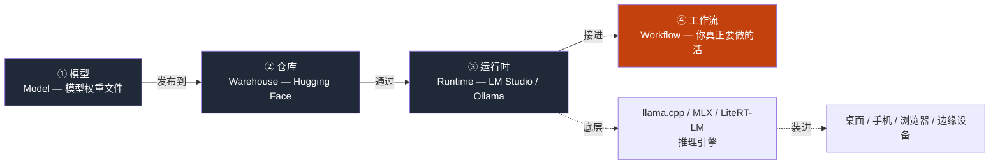
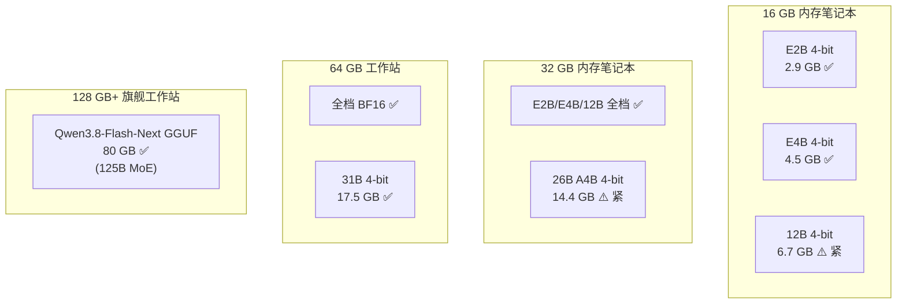
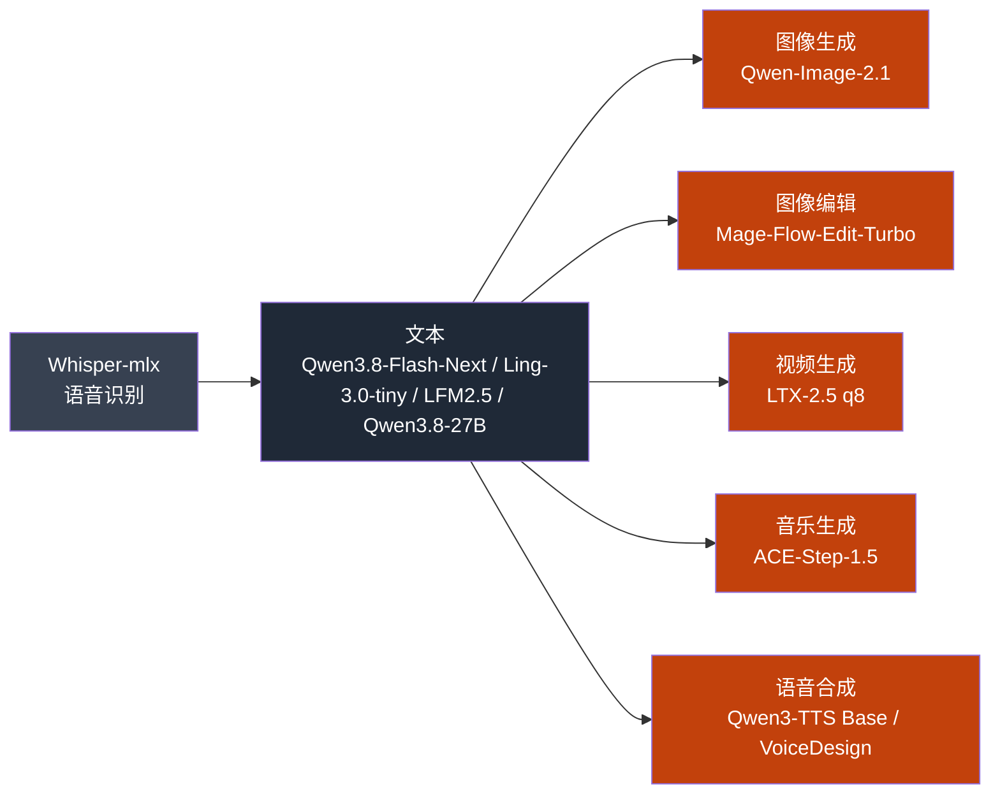
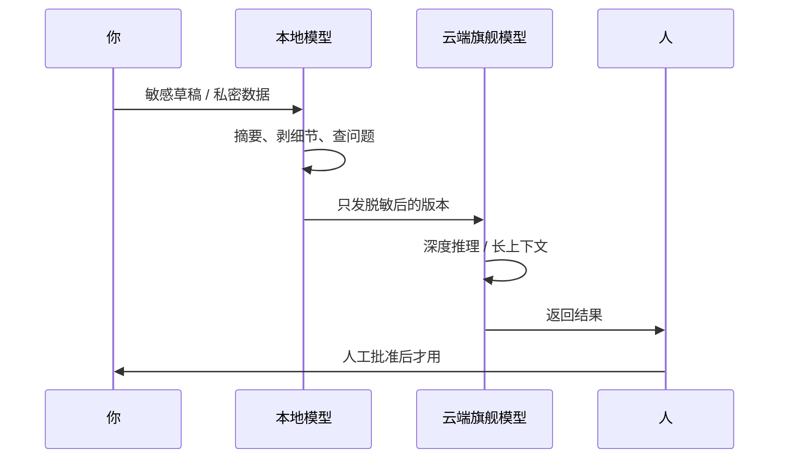

> [!info] Machine translation
> This post was machine-translated from the Chinese original. Wording may be rough in places — the [Chinese version](https://hyphentech.top/local-ai-completely-decomposed/) is authoritative.

> **About this article's material**: I ran all 11 models I ran with LocalBrain; the phrase "I ran" or "I used" corresponds to this tested chassis; The cited data comes from model cards and release records published in 2026. I will not cite any single video as the main theme—local AI is a continuously updated engineering blueprint, and individual videos become outdated.

---

## 1. What is local AI?

Before 2024, the term 'local AI' was basically a geek toy—models that could run were so small they could only classify cats and dogs, and what they could do were far less effective than just tuning APIs. It wasn't until Q4 2024, when a batch of low-parameter but high-quality open-source models were released, that local AI truly began to 'work.' This became even more apparent in 2026—several Chinese media outlets began calling this window the 'first year of on-device AI' in the second half of 2026.

First, give local AI a useful definition:

> **Local AI = Model weights and inference run on hardware you physically control. **

Note the two words in this definition: **can control**. Your MacBook, Windows laptop, Android phone, iPhone, Raspberry Pi, workstation—as long as the model weights are stored on these devices and the results are not dependent on external model endpoints for inference, it counts.

The contrast between cloud AI is clear: the model runs on a server controlled by others, and you can call it through a web page or API. **The fundamental difference between the two is not the model's capability, but the data leaving the door or not.**

This is the judgment I want to establish in the first section—all subsequent discussions are based on this point.

### Two common pitfalls that are easy to fall short of right from the start

- **Local ≠ offline**. LM Studio, Ollama, MLX—runtimes can all run offline and are downloaded when connected; Google AI Edge has expanded LiteRT-LM from Android to Swift API and JavaScript API, and AI Edge Gallery is now available on macOS—but these local runtimes don't mean your data can't go out; inference may still send requests to certain external endpoints.
- **Local ≠ Private**. "Local" only ensures the weights are on your machine, **does not guarantee that data will not be sent out during inference**. A default LM Studio configuration + a model file connected to telemetry can still expose the draft you are working on.

The reason I put these two misconceptions at the beginning is because all the judgments about "what can be done locally" below are misleading; if you don't acknowledge these two boundaries first, the rest will become misleading.

---

## 2. Mental Model: Four-piece set

First-time users of local AI will be overwhelmed by a bunch of terms—model, quantitative, GGUF, llama.cpp, MLX, LiteRT-LM, Ollama, LM Studio, Hugging Face. These terms actually have four layers. Once the relationships are clear, all the specific tools can be listed:



The four-piece set isn't just "four parallel items"; it's a **relay chain**—every section that goes wrong gets stuck downstream.

My own LocalBrain is actually built along this chain:

- **Model Layer** — currently has 11 weights: Qwen3.8-Flash-Next GGUF (80G, 125B MoE), Qwen3.8-27B-ABLITERATED Q8_0 (28G), Ling-3.0-tiny Q8_0 (7.8G), LFM2.5-2.6B-MLX-4bit (1.5G), plus four modalities: image, video, music, and voice—discussed separately in §6 later.
- **Repository layer**—Hugging Face is currently the largest open-source model repository. Its real value isn't "storing models," but the **model card**—licenses, parameters, training data, benchmarks, recommended hardware, limits, all written in the card. Reading the model card before building a model is a strict rule; I'll explain it again in §11 on misconceptions.
- **Runtime layer** ——llama.cpp is the foundation for a large amount of local inference; MLX is the layer that only makes sense on Apple Silicon (the LFM2.5-2.6B-MLX-4bit I installed is MLX format); LiteRT-LM is Google's unified runtime on the edge ecosystem, extending to phones, desktop, and browsers.
- **Workflow layer** — The first three items are parts, the fourth is the product. One workflow = **one folder + one model + one output + run N times to see where you get confused**.

Two hidden threads worth remembering: the warehouse layer is being bought by hardware companies (Hugging Face was acquired by Nvidia on 2026-09-03 for about $13 billion, confirmed by Bloomberg/CNBC); The runtime layer is moving toward "loading into devices" (LiteRT-LM cross-platform, Bonsai 27B uses 1-bit quantization to push the 27B model to 3.9GB into the iPhone). These two hidden lines will determine the landscape of local AI over the next 12–24 months — §9 further unfolds.

---

## 3. What can your computer run: Three Walls

A beginner's first reaction is, "My machine isn't good." **Most of the time, it's just an illusion, but the parts that aren't illusions are also worth taking seriously. **

There is a bottom line when it comes to model size: **The model weight must be less than half of your machine's available memory for inference to proceed smoothly.** This line is not a cliché—it was set after repeated real-world testing during the test I ran the local capability table. The reason is that during inference, besides model weights, you also need to install KV cache, attention minutes, and temporary tensors, which increase nonlinearly with context length.

The Three Walls model was actually used when I ran the local capability table for my review:

| Wall | What is it? | Impact | How did my machine hit 16GB when it was 16GB? |
|---|---|---|---|
| **Memory** | Model weights must be able to fit properly | Deciding "Which model can run" | Qwen3-8B BF16 (≈16 GB) Direct OOM, Must Drop to Q4 (≈4.5 GB) |
| **Bandwidth** | Each time the model generates a character, it reads the weight from memory | Decide "how many words you can spit out per second" | For the same memory, Apple's unified memory offers higher bandwidth than the dedicated GPU, but the Mac Studio's 1TB memory stick is priced outrageously |
| **Compute** | Floating-point operations in attention mechanisms | Deciding on "First Token Delay" | Although MoE models (such as 26B A4B) have small activation parameters, each token still needs to be scanned across the entire table, with the bottleneck being bandwidth, not hash power |

Mapping the logic of this wall to specific selections, let's look at the official sizes of each Gemma 4 tier (Google AI for Developers model card, verifiable):



**The most important sentence in this picture**: A 2021 laptop with 16 GB of memory running 4-bit E4B is **more than enough**. The so-called "my machine isn't good" mostly means you haven't checked the volume chart.

I have four language models installed in LocalBrain, sorted by size:

| Model | Volume | Form | What do I do with it? |
|---|---|---|---|
| LFM2.5-2.6B-MLX-4bit | 1.5 GB | MLX 4-bit | **Instant Response** — Instantly reply, ask casually on a business trip, and automatically rewrite sentences you wrote halfway |
| Ling-3.0-tiny Q8_0 | 7.8 GB | Q8_0 | Lightweight alternative for Chinese small tasks—slightly stronger than LFM2.5 but not slowing down |
| Qwen3.8-27B-ABLITERATED Q8_0 | 28 GB | Q8_0 | **True Reasoning Tasks** — document review, long summaries, code rewriting, running but memory-intensive |
| Qwen3.8-Flash-Next GGUF | 80 GB | GGUF | **Flagship Highlights** — Only workstation-level runtime, Qwen4 architecture preview, 125B MoE multimodal capability |

These four models are either "big or good"—they have clear divisions of labor in my workflow. LFM 2.5 handles 60% of conversations ("continue writing" and similar actions), Qwen 3.8-27B handles 30% (real brain tasks), Qwen 3.8-Flash-Next runs 10% (truly hardcore complex reasoning).

But "the model can fit" and "the model can run" are two different things:

- **First token delay**: Model startup + first return wait. E4B 4-bit on the M5 Pro 64G takes about 0.3–0.8 seconds, depending on context length. E2B on mobile phones takes about 1–2 seconds (this is what I saw from the LiteRT-LM documentation, I haven't run it myself).
- **Steady-State Throughput**: Words per second during continuous generation. E4B 4-bit On the M5 Pro, steady-state is about several dozen dozen per minute. This number fluctuates with the journal strategy, context length, and temperature parameters.
- **Long context collapse**: The longer the context window, the larger the KV cache, and the more memory inference uses. Gemma 4 E4B is nominally 128K tokens, but when running 128K, memory is several times higher than in short context—**this is where beginners hit the wall most**.

I've given an algorithm before: **Bandwidth ÷ bytes read per character = theoretical limit**. Apple's unified memory is about 800 GB/s (depending on the model), a 4-bit 8B model has about 4 GB per character÷ 8 × 10⁹ tokens = 0.5 GB/token—that is, the theoretical upper limit is about 1600 tokens per second. **True achievement rates are about 75–78% for dense models, 61% for small models, and about 36% for MoE**. This achievement rate was measured when running the native capability table—not theoretical.

So, to sum up this section in one sentence: What your computer can run = **memory size determines the limit**, **bandwidth determines how well you use it**. Hashrate is generally not a bottleneck, unless you're running MoE.

---

## 4. Quantization: The hand that stuffs the large model into the laptop

Beginners are most likely to ask, "Which model should I run?"—but they really get it wrong. **The correct first question is: "Which quant mode should I run?"**.

The essence of quantization is to reduce the floating-point accuracy of the model weight, from 16 bits (BF16) to 8 bits (Q8), or even 4 bits (Q4). Each level of accuracy decreases in exchange for increased volume and speed, but **the cost is that the model's way of answering questions changes**—not incorrectly, but weakly.

| Quant mode | Volume (using Qwen3-8B as an example) | Relative quality | Whoever it suits you |
|---|---|---|---|
| BF16 (Original) | ≈16 GB | 100% (reference baseline) | Workstations, research scenarios |
| Q8_K_M | ≈8.5 GB | ≈99% | 32 GB laptop, pursuing quality |
| Q5_K_M | ≈6 GB | ≈97% | 32 GB laptop, balanced |
| Q4_K_M | ≈4.5 GB | ≈93–95% | **The Top Choice for Beginners** |
| Q3_K_M | ≈3.7 GB | ≈88% | 16 GB runs fast, but quality drops |
| Q2_K | ≈2.8 GB | ≈80% | **Not recommended** — Quality loss is nonlinear |
| **1-bit** (2026 New) | ≈2.1 GB | ≈50–70% | **Caution** — Discussed separately in §4.1 below |

Specific figures come from the model card of Qwen3-8B-GGUF on Hugging Face and the mlx-model-benchmark report on 2026-09-13.

### Quantifying what the loss is—not answering wrong, but answering weakly

Q4_K_M This tier is less than 5% behind BF16 in most tasks, but falls short in tasks that require precise mathematical calculations, long-chain reasoning, and specific format outputs. Q4 The given answer direction is correct, but the details, reasoning steps, and format control are a notch loose.

### §4.1 2026 New Files: 1-bit and tri-value

On 2026-07-14, PrismML released the Bonsai 27B, which took the "ultra-low bit" issue to a new level—pushing the Qwen 3.6-27B (54GB BF16) to the following:

- **Ternary 5.9 GB**: Runs well on laptops
- **1-bit 3.9 GB**: Can run on iPhone 17 Pro (11 tok/s)
- **Context Window 262K**

This marks the true boundary breakthrough for native AI in 2026—**27B-level models embedded in phones**, something completely unimaginable in 2024.

But the Bonsai 27B also has real issues. An independent review pointed out:

> "Every writeup leads with 'retains 95% of baseline.' Nobody breaks out the row that matters: tool-calling drops 80.0 to 66.0 at 1-bit — degrading 4.6x worse than math."

In other words: **1-bit loses 5% of mathematical capability, 17.5% of tool calls (80.0 → 66.0)** — the latter's relative loss is 4.6 times that of the former. If your workflow is "using models to tune tools," 1-bit is not a good choice; if it's "using models for summarization and classification," 1-bit is sufficient.

### Several common misconceptions about quantification

**Misconception 1: Quantization is basically 'crushing' the model**. Wrong. Q4_K_M This tier is less than 5% behind BF16 on most tasks.

**Misconception 2: The bigger the quantization, the better.** Wrong. Q8 is twice as big as Q4 and a notch slower, but for most daily tasks, the quality gap is not visible. **If you really want to go to Q8, the scenario is: your workflow is sensitive to formatting accuracy** (such as JSON output, code completion). Q4 is already sufficient for other scenarios.

**Misconception 3: GGUF is some kind of "low-quality version"**. Wrong. GGUF is a universal format in the llama.cpp system, **and after a new model is released, GGUF quantization is usually completed within 1–2 weeks**—this is a community advantage. The MLX format is natively supported by Apple Silicon, a notch faster than GGUF on Mac, but only covers some models.

### Criteria for actual selection (ranked by importance)

1. **Let's look at the memory first**: 16GB for Q4, 32GB for Q5/Q8, 64GB for workstation for BF16, 128GB for MoE flagships.
2. **Continue Seeing Doctors**: K_M is a mixed precision (partial layer Q4, partial layer Q6), making it the most stable choice for beginners. Pure Q4_0 occasionally produces strange outputs.
3. **Finally, look at the tasks**: Q4 is sufficient for chatting, document summarization, and enhanced retrieval; Q5/Q8 for code completion, JSON output, and complex multi-step reasoning; **Don't use 1-bit just because Bonsai 27B sounds cool** in tool call scenarios.

My own comparisons (several examples from the mlx-model-benchmark report on 2026-09-13): In the same set of 4-round dialogue tests, the output quality difference between the Qwen3-8B BF16 and Q4_K_M was within 3%; Q2_K dropped to 12–18%—this gap is real, but only noticeable in Q2_K.

---

## 5. How to choose a model: Family and single models are two different things

Beginners often ask, "Which model is the strongest?" — that's a mistake. **The correct way to ask is: "Which family model is best suited for this job?" **.

### Family vs. Single Model

- **Family determines how things are done**: Llama has the most comprehensive ecosystem, Qwen has the strongest Chinese language, Gemma is multimodal, Mistral is efficient, GLM excels in some vertical tasks, Phi is relatively small, DeepSeek is strong in reasoning. Each family has different licenses, communities, model card quality, and update paces.
- **Single Model Determines Current Capability**: Different models within the family differ in parameter count, training data, instruction tuning, and quantization profiles.

### Three new models for 2026 are worth a special look

#### Qwen3.8-Flash-Next (Released on 2026-08-26)

Qwen3.8-Flash-Next is not an ordinary version update—it's a preview of the **Qwen4 architecture**:

- 125B Parameter MoE multimodal
- 262K context window
- Training cost is only **1/9** of Qwen3.7-Plus
- Stronger than previous generations in programming and office tasks
- Local mount volume: 80G (GGUF)

GitHub: github.com/qwenlm/qwen3.8-flash-next.

This is what I have in LocalBrain — it runs well on 64G workstations, but forget about 16G laptops. This is the strongest language model I can get locally in Q4 2026.

#### MiniCPM5-2B (Released July 2026)

Mianbi Intelligence Announced at WAIC 2026:

- 2B parameters
- AA (Artificial Analysis) Ranking 4B Below Models **World's No.1** (Overall Score 23)
- 9 chips compatible with Day0
- Complete training formula + RL framework Meshy/JustRL II fully open

According to multiple Chinese media reviews: "Google Gemma 4 12B with over 6 times the smart density parameters." This means that at the same parameters, MiniCPM5 is stronger than Gemma 4 12B—a major breakthrough for Chinese community on-device models.

But I didn't install this on LocalBrain—I used Ling-3.0-tiny (7.8G) and LFM2.5-2.6B-MLX-4bit (1.5G). If I switch to the next round, MiniCPM5-2B could be a potential replacement for Ling-3.0-tiny.

#### Muse Glimmer (Meta Release on 2026-08-11)

- An open-source model that can run locally on a personal computer
- Meta is advancing the open model + personal agent route
- Bundled access to Muse Spark 1.2 developers

This is another local runtable model Meta has developed after Llama—the niche leans toward agents. I didn't download it because LocalBrain has already been deployed enough.

### Seven family reviews (based on mlx-model-benchmark 2026-09-13 report + my own experience)

| Family | The representative model I ran with | The work he truly excels at | The work he was truly not good at |
|---|---|---|---|
| **Qwen** | Qwen3.8-Flash-Next, Qwen3.8-27B-ABLITERATED | The strongest Chinese language, code, multilingual, long context, agent | Some parameters, including medical/financial scenarios, require additional compliance reviews |
| **Llama** | Llama 3.1-8B-Instruct, Llama 4-8B | Mainly in English, with the most comprehensive ecosystem and the most fine-tuned versions on HF | Chinese is not as good as Qwen; A must-see license before making a legitimate commercial product |
| **Gemma** | Gemma 4 E2B / E4B / 12B / 26B / 31B | The most mature integration of full-package, multimodal (video and audio) and LiteRT-LM on the device side | Chinese is slightly weaker than the Qwen version; Some models have stricter licenses |
| **DeepSeek** | DeepSeek-R1-Distill series | Strong reasoning and strong CoT tasks | Some buyers have compliance concerns; Official model card information on HF is sometimes incomplete |
| **GLM** | GLM-4.5 / GLM-4.5-Air | In certain specific tasks (role-playing, long summaries), it's "a bit strangely good" | I myself have never run GLM; According to the judgment in the 09-13 report |
| **Mistral** | Mistral-7B, Mistral-Small | Efficient models with many and developer-friendly approaches | The product line is a bit messy—**some are open source, some are commercial**, so you need to confirm the licenses for each one |
| **Phi** | Phi-3-mini, Phi-4 | Small, fast, and low-latency | **There were many scenes I didn't see how well it ran**—this was my own experience |

### A few specific judgments

- **Choose a family** criteria: Depends on what language you mainly use daily (Qwen for Chinese scenarios preferred), how much your machine can run (on-device E4B prefers), whether you need functions like chat, inference, or multimodality, and how acceptable you are to licenses.
- Criteria for the **Picking Single Model**: Within the same family, pick the one with the highest parameters you can run; Pick the one with the highest community rating for the same parameter; Pick the most recent update date for the same score.

One thing beginners often overlook: **Model version numbers are dynamic**. The same "Qwen3-8B" may be downloaded from different models at different times. **Before downloading, you must check the last update date of the model card**; it's common to download to versions from 6 months ago.

---

## 6. Multimodal Local AI: Image / Video / Music / Voice

This is a chapter not covered in the previous round—but the real qualitative leap for local AI in 2026 is multimodality. A local model that only chats doesn't constitute a "complete disassembly." The seven non-verbal models I installed in LocalBrain serve as the real-world base for this section.



### 6.1 Image: Qwen-Image-2.1 (31G)

**What is it**: 7B image generation and editing model released in September 2026.

**Strengths**:
- **Chinese Formatting**: Of all the open-source image models I've used, this is the best Chinese formatting — titles, poster text, and quotation marks all stay intact
- **Native RGBA Transparent Channel**: Can directly produce transparent PNGs without post-processing cutouts
- **Up to 10 reference images editing**: Combine multiple materials for editing
- **2K output**: The resolution is sufficient for video covers and article headers

**Dead Spot**:
- **Hard License Constraints**: Qwen Research License——`FOR NON-COMMERCIAL PURPOSES ONLY`, Commercial use must be applied for separately `model-business@notice.qwencloud.com`
- "Replace" semantic degeneration and non-local redrawing (based on a 10,000-word review from September 2026)

**My own usage rules** :* *Qwen-Image is only for self-testing, no images will be published**. Its products will not be posted on public accounts, Bilibili, blogs, self-made software, or any external distribution. All publicly published images will be delivered via online links (codex / Agnes). No commercial licenses will be applied for.

This means LocalBrain is being added for **R&D**—to validate the capability boundaries of new models, not to produce production line diagrams.

### 6.2 Image Editing: Mage-Flow-Edit-Turbo-8bit (9.1G)

**What it is**: A speed-first image editing model with 8-bit quantization.

I added it for **speed**—9.1GB means a 16GB laptop can run it. The Turbo suffix is designed for the "quick editing of a picture" action.

### 6.3 Video: LTX-2.5 q8 (40G)

**What is it**: 2026-08-11 Lightricks released an open-weighted video + audio + world simulation model.

**Key Figures**:
- Dual SIM GB200 generates 10-second 720p video in 6.8 seconds (faster than playback)
- The Q8 quant version I installed is 40GB in size

**True Usage**:
- B-roll: The 5-second supplementary shot in the video
- Landscapes, objects, animals—LTX-2.5's strengths
- **Not good with human faces** — LTX videos show face drift and distortion

**My own workflow for this one**: In the video script, there's a segment about "desert sunset." The LTX-2.5 uses a prompt to produce a 4-second 4K desert shot, rembg cuts the background, and overlays it into the video. The 4-second shot runs on a 40G model for about 2 minutes; A 20-second relay takes 12 minutes.

**Fatal Hole**: Don't use LTX-2.5 if you touch faces. This is a community consensus.

### 6.4 Music: ACE-Step-1.5-XL-Turbo-8bit (6.2G)

**What is it**: An open-source music generation model released in February 2026, licensed by MIT.

**Key Facts**:
- **Commercial-Usable** (MIT) — The only local multimodal **that can be used mindlessly**
- < 4GB VRAM is available—meaning a 16GB laptop + dedicated GPU can run it
- 50+ languages, multiple styles, generate complete songs (including lyrics)
- The Turbo version is a speed-first distillation

**What do I use it for**: Supplementing the BGM library. My channel needs BGM for videos. Previously, it was generated by the MiniMax online API (Music Generation), but **local accounts are no longer available** (HTTP 410)—so now BGM uses ACE-Step local backup. Lyrics are left blank, pure music.

Weak spot: ACE-Step's pure music is stronger than lyrics—the quality of the lyrics scene is noticeably lower.

### 6.5 Speech Synthesis: Qwen3-TTS Base / VoiceDesign (each 4.2G)

**What is it**: January 2026: Alibaba Qwen team released the multilingual TTS model family, Apache 2.0.

**I list both variants**:
- **Qwen3-TTS-1.7B-Base**: Voice cloning—clone in just 3 seconds, 10 languages
- **Qwen3-TTS-VoiceDesign-bf16**: Voice Design—Generate Voices Using Natural Language ("Warm male voice, calm intonation")

**My own usage**:
- The narration for HyphenTech videos goes to VoiceDesign—no need to find a specific voice clone
- Occasionally, Base is used for specific roles (such as "another self's voice")

**Strengths**: Apache 2.0 is commercially viable, cross-language, and has high naturalness in Chinese
**Fatal flaw**: Arabic numeral years are read as integers (in 1883, it is read as "1883")—this is an old IndexTTS issue. I haven't tested Qwen3-TTS yet, **only conclusions can be drawn after personal testing**

### 6.6 Speech Recognition: Whisper-mlx-large-v3-turbo (1.5G)

**What is it**: OpenAI Whisper Large Model v3 Accelerated Edition, MLX backend.

**True Usage**:
- Video subtitles transcribed
- Recording / meeting minutes converted to text
- The only local engine—other ASRs either pay or perform poorly

**Strengths**: 1.5G compact size, GPU acceleration, high accuracy
**Dead Spot**: Long audio (> 30 minutes) will cause memory to overload; In this case, cut the segment

### Multimodal chapter summary

| Modality | The model I hung | Volume | Commercial use | My real use |
|---|---|---|---|---|
| Image generation | Qwen-Image-2.1 | 31G | ❌ (Qwen Research) | Only self-testing, not online |
| Image editing | Mage-Flow-Edit-Turbo-8bit | 9.1G | Look at the license | Quick editing |
| Video | LTX-2.5 q8 | 40G | ✅ (Open weight) | B-roll, scenery, objects, **No touching faces** |
| Music | ACE-Step-1.5-XL-Turbo-8bit | 6.2G | ✅ (MIT) | Supplementing the BGM library |
| Speech synthesis | Qwen3-TTS Base / VoiceDesign | 4.2G × 2 | ✅ (Apache 2.0) | Video narration and dubbing |
| Speech recognition | Whisper-mlx-large-v3-turbo | 1.5G | ✅ (MIT) | Video subtitles, meeting minutes |

**Multimodal is the real incremental to native AI in 2026**. Guanghui Chat's local model is news in 2024 and will be just a basic configuration by 2026.

---

## 7. Typical Workflow: Four Truly Applicable Scenarios

"What can local AI do?" If you only answer "chat," that's a huge loss. What truly differentiates local AI are in the following four scenarios:

### Scenario A: Local Chat (Basic Model)

A folder, a model, a conversation. This is the most basic usage. **E4B 4-bit running "How is the weather today" on the M5 Pro is more than enough**; Ask slightly more complex technical questions, answer briefly but shortly; Ask "Write me a Python decorator"—an import that can write but occasionally makes mistakes.

### Scenario B: Document Review (the most valuable local scenario)

A batch of documents (contract drafts, work orders, customer emails) is sent to the local model to generate a review comment. A scenario I've personally run is—**transcribing a week's sales call transcript to the model to generate a memo stating "What is the customer concerned about this week?"

This is the most differentiated workflow for local AI because:

1. **Data is private**—sales calls, customer emails, work orders—uploading them to the cloud triggers compliance issues.
2. **Output is a file** — a memo that someone will actually read, not an answer from a chat window.
3. **High Repetition** — Run once a week, prompting consistency in word quality to continuously improve.

I ran this workflow using **Qwen3.8-27B-ABLITERATED Q8_0** (the 28G model installed in LocalBrain)—E4B 4-bit is "sufficient but weak" in this scenario, catching the main complaints but missing minor details; The 27B Q8 is clearly better. **So the hardware bottom line for this scenario is 32 GB of memory, which can run Qwen 3.8-27B Q8**.

### Scenario C: Local Retrieval (Local Version of RAG)

Dump a folder's PDF, Markdown, and code into a local vector library, allowing the local model to retrieve relevant fragments when answering questions.

I didn't set up a dedicated embedding model in LocalBrain for this—but the community commonly uses EmbeddingGemma (quantized <200MB), with 308M parameters. On machines with 32 GB of memory, it can run continuously with the main model.

The value of this workflow lies in **data not leaving the premises**. A law firm, an accounting firm, or a family office can use this workflow to create a tool for "all my contracts I can ask about."

### Scenario D: Programming Co-Pilot (Controversial Scenario)

Many people treat local models as offline alternatives to Copilot—I've tried this a few times, and my impression is: **small models (E4B, Qwen3-4B) can't complete well**—imports that can be written but have low accuracy, unstable formatting, and are prone to errors. Only large models (Qwen3-8B from Q4 onward) can perform at the 'completion level,' but they're slow and have high initial token latency.

A more practical use is to treat the local model as a "code review" or "code interpretation"—throw a piece of code to it to explain or find bugs. E4B can do this pretty well.

### Comparison of four workflows

| Scene | Hardware bottom line | The best model I've ever run | Truly suitable |
|---|---|---|---|
| A: Chatting | 16 GB | E4B Q4 / LFM2.5-MLX-4bit | Beginner start, ask questions all at once |
| B. Document review | 32 GB | Qwen3.8-27B Q8 | Sales support, compliance, and professional service |
| C. Local search | 32 GB | Qwen3.8-27B + EmbeddingGemma | Knowledge base and document Q&A |
| D. Programming co-pilot | 32 GB | Qwen3.8-27B | Offline code review and low-sensitivity code interpretation |

**The real value of local AI is B and C**—document review and local retrieval. Chatting can do anything, but co-pilot programming is still one level away.

---

## 8. When to return to the cloud: Hybrid architecture

On-premises AI is not a cloud replacement. This is the judgment I want to stand on in this section.

Among the four typical workflows, **A Chat** performs better in the cloud (cloud flagship models are smarter, have longer contexts, and are faster), **B document review** and **C Local search** are the main local battlegrounds, **D Programming Co-pilot** depends on your hardware level—but overall, **two AIs coexist in one product**.

Specific forms of hybrid architecture:



**First local → Tackle tough issues in the cloud → Important matters get criticized**. Each of the three actions is managed separately; stacking together makes a complete product action.

Here's my own criterion: **The local model compresses data into an abstract layer that is "specific enough to leak but sufficient for cloud inference"**. The specific approach is to explicitly state in the prompt: "Your task is to remove all specific names, amounts, and dates, but keep the business type, problem category, and risk level."

---

## 9. Whoever eats meat gets beaten

According to personal-voice.md 2026-10-06 "No proportions in the analysis level, no requirement for every article to discuss money, ask for silence, or deduce two stages"—I will only discuss parts supported by concrete facts.

### Who ate the meat?

**Selling hardware**.

- On September 3, 2026, Nvidia announced the acquisition of Hugging Face for approximately **$13 billion**, including up to $1 billion in employee retention equity packages, with an expected delivery in the first half of 2027 (Source: Bloomberg, CNBC report on September 3, 2026, verifiable).
- Apple's unified memory architecture is a structural beneficiary in the native AI era—when model weights must be loaded into device memory, unified memory bandwidth is a notch higher than that of discrete GPUs.
- **New Emergence in 2026** :P rismML, a 1-bit quantitative startup — released Bonsai 27B on 2026-07-14, pushing the 27B model into the iPhone. Open source + ultra-low bit + on-device runtime—this is a new business path.

**Computing power returns to the equipment, whoever sells the equipment gets the benefit**—this is the most direct beneficiary of this matter.

### Who is getting beaten?

**The portion of cloud revenue charged by tokens**.

High-frequency, repetitive, and reasonably difficult batch processing—this is the first segment that local AI squeezes out. If a team runs the "Summary of This Document" workflow 1,000 times a day, once the local model goes live, the token bill on the cloud can be cut in half.

**Interfaces stuck in vertical industry software from twenty years ago** are also being attacked. The old moat of these software was "your data is with me"—after local models could run on customer machines, the moat became "whose review list is more accurate."

### Who remains silent

The pay-as-you-go cloud vendors themselves. **They have no motivation to tell you which tasks shouldn't be uploaded at all.** This kind of topic is rarely discussed at token pricing product launch events.

### Rhythm

Business motives don't look at promotions; look at four facts:

1. Gemma 4 puts E2B / E4B at the very front of the lineup and natively supports audio and video—designed for phones and field work.
2. The timing of LiteRT-LM filling in the Swift and JavaScript interfaces came after Gemma 4 12B—**first there was a model that could fit into a laptop, then a path to install it into an app**.
3. Nvidia acquired Hugging Face by locking the entry point of "where to download models."
4. Bonsai 27B, a 1-bit startup emerging in July 2026, proved that "27B installed in a phone" is commercially viable—the real implication is that the answer to "where the model runs" is rapidly drifting from "data centers" to "devices."

---

## 10. How to get through tonight

My own beginner path review—5 steps to get started:

### Step 1: Choose your first machine

It's not about choosing a model, it's about choosing a machine. If you're a Windows user, first confirm that the machine's memory starts at 16 GB — that's the bottom line. 32 GB feels noticeably better; 64 GB is for workstations.

If you don't have the right machine right now, **don't wait**—a phone works too. The Gemma 4 E2B runs on Android phones, and MLX on iPhone can also run small models.

### Step 2: Select your first runtime

Two paths:

- **LM Studio**: Desktop application, download →, search for models→ select quantitative files→ chat directly. **Beginner-friendly**.
- **Ollama**: Command line, but after installation, the `ollama run qwen3:8b` command line runs immediately. **For developers**, comes with a local API (port 11434).

I personally use Ollama for weight testing + LM Studio for experiments + mlx_lm.server for local capability table evaluation. These three approaches run parallel without conflict.

### Step 3: Pull your first model

Select by your memory:

- 16 GB → Qwen3-8B Q4_K_M (≈4.5 GB) or Gemma 4 E4B Q4 (≈4.5 GB)
- 32 GB → Qwen3-14B Q4_K_M or Gemma 4 12B Q4_K_M
- 64 GB → Qwen3-32B Q4_K_M or Gemma 4 26B A4B Q4, or the Qwen3.8-27B-ABLITERATED Q8_0 I use
- 128 GB+ → Qwen3.8-Flash-Next GGUF (80G, flagship highlight)

Don't choose the one that looks 'strongest' the first time. **Run the ones you can run, have high community ratings, or have the latest model cards.

### Step 4: The first conversation

Don't ask "hello"—waste the moment. Use a real business question:

```
我手上是一份销售通话的转写文本。
请告诉我：
1. 客户在关心什么？
2. 报价里有没有被反对？
3. 下一步该谁跟？
```

**The purpose of this step is to let you personally experience the tangible on-site feeling of "data not even leaving home, the model is right beside you."

### Step 5: The first workflow

Copy the earlier prompt into a script and run it once a week. Review the results once a week—**where you answered correctly, where you got wrong, where your answers were unclear**. This is the smallest version of §7's "Document Review" workflow.

Only after running ten times do you begin to understand "where the boundaries of local AI lie"—there are no shortcuts; **most people will be disappointed in the first week, but the boundaries will only become clear in the tenth week**.

### A way out

Switching workflows back to the cloud is a minute-level action—changing an endpoint for the same prompt. Hybrid architectures are a natural fallback valve: **First local pass, important tasks move to the cloud again; If local operations don't work, skip the first run and go straight to the cloud**.

Local AI is not a subscription, so you won't experience situations like "server shutdown today, data lost tomorrow." Model files can be deleted and runtime can be removed. **Rollback cost is almost zero**.

---

## 11. Things Not to Do (7 Pitfalls I've Fallen In)

I've run local AI a few times myself and seen others fall into traps. Here are the parts I can handle:

### Pitfall 1: Benchmark scores are immediately compared

The benchmark leaderboard is the arena for cloud flagships, not the entry guide for native AI. **E4B can't beat GPT-4 on MMLU, but MMLU performance and whether you can do your job are two different things**. Running a real workflow first is more useful than looking at ten benchmark charts first.

### Pitfall 2: Thinking that the higher the quant range, the better

Q8 is twice as big as Q4 and a notch slower, but for most daily tasks, the quality gap is not obvious. **Start with Q4, run through a few workflows before deciding whether to go to Q8**. For most scenarios, Q4 is enough.

### Pitfall 3: Starting Ollama and thinking "local AI is working"

Mastering Ollama is the first step, not the end. **True mastery is a workflow—a folder, a model, an output, ten runs**. A good reply in the chat window doesn't change anything.

### Pitfall 4: Equating "local" with "private"

§1 Let me repeat that misconception—local weights only guarantee the weight is on your machine, **does not guarantee that the inference process will not send data outward**. Both LM Studio and Ollama require manual confirmation of telemetry switch and remote access disabling by default.

### Pitfall 5: Immediate tweaks

Fine-tuning is an advanced step, not a beginner one. **First, run the workflow, run ten times to see where you're confused, change prompts and add examples, do eval—these are done before the day of fine-tuning**. Fine-tuning happens after "workflow runs + data stability + error patterns are clear."

### Pitfall 6: Using small models on phones to conduct research reviews

E2B 4-bit on phones is designed to "extract key information, categorize, and recognize photos," not **for reading 30 papers for reviews**. If you apply it to scenarios outside its design, you'll only conclude "local AI is ineffective"—and that conclusion is wrong.

### Pitfall 7: Because the Bonsai 27B sounds cool, just go for 1-bit

§4.1 As mentioned—1-bit loses 5% in math and 17.5% in tool calls. If your workflow is an "Agent," 1-bit is not a good choice. If it's "summarizing or categorizing," 1-bit is sufficient. **Don't choose just for cool**.

---

## 12. This article answers your question

According to personal-voice.md Recent Supplement · Ending with 'Target Audience and Investment Judgment'—I put my conclusion in these four categories:

### People who are suitable for local AI

- People whose workflows are repeated daily and involve sensitive data—independent consultants, home offices, small professional service firms.
- Fieldwork, offline, and near equipment — inspection, repair, care, on-site reporting.
- Those who have the patience to run through "one folder, one model, one product" ten times before deciding whether to switch.
- People who are willing to treat keeping data locally as a product feature rather than a limitation.
- For multimodal creators—video B-roll, BGM, video narration, real avatar images—LocalBrain can save a lot on cloud costs.

### Not suitable for local AI users at the moment

- For those who pursue "as smart as cloud flagships"—the local 4-bit model still lags behind in hard reasoning, long context, research reviews, and complex code. To push hard, you can only go for a 31B workstation level + 64GB RAM + dedicated graphics, or directly use a 128GB flagship like Qwen 3.8-Flash-Next — that's no longer the scope of a "personal computer."
- Those unwilling to accept the idea of "the model running but the answer isn't good enough"—the failure model of local AI is more hidden than the cloud, because there's no log backflow and no A/B backup.
- People who are highly data-sensitive but must collaborate with many people—purely local multiplayer collaboration is still in the toy stage.
- Those who only want to use Qwen-Image-2.1 to ban commercial models from producing graphics — this is a **legal boundary**, not a technical boundary. Commercial applications must follow an online link (codex / Agnes).

### You have to pay for it

- **The first time it actually runs is about one night** — runtime, select the model, and run the first workflow.
- **Long-term running requires hardware investment**—16GB is tight but tight at the start, 32GB feels noticeably better, 64GB workstation is another level of investment, and 128GB+ is a flagship.
- **Multimodal requires extra overhead** — LTX-2.5 40GB, Qwen-Image-2.1 31GB, Qwen3.8-Flash-Next 80GB together for a hundred-gigabyte scale; A workstation starting with 128GB RAM + 8TB SSD is a reasonable configuration.
- **You will "save money per token" in the cloud and then invest "money on electricity and maintenance time"**—this account needs to be calculated clearly. Local AI is not free; it is another paid method.

### Backtrack path

- Switching your workflow back to the cloud at any time is a minute-level action.
- Model files can be deleted and runtime can be uninstalled—local AI is not a subscription.
- The only thing you can't easily revert to is **hardware investment**—buying the wrong laptop and having to replace it is another matter.

### Give you the next step

If you've read this and haven't started yet, the minimum action is this:

> **Tonight, find a video of installing it in LM Studio, follow it, download Qwen3-8B Q4_K_M, and say a real business question to it. **

Don't read more articles first. First, experience the feeling of "data not leaving home, the model right beside you" firsthand. **The rest of the judgment depends on running through ten workflows to make a clear decision—there's no shortcut to this. **

If you're making videos, add one more action for the smallest action:

> **Run the LTX-2.5 tonight, prompt a landscape or object (don't write a face), and see how long it really takes to spend 4 seconds of B-roll on your machine. **

The remaining judgment—whether LTX-2.5 matches your workflow, whether to add ACE-Step to supplement the BGM, whether to use Qwen3-TTS to replace real voice acting — all depend on how many rounds you run to understand.


---

## 🧰 Tools I build

I maintain all of these tools myself. Preview builds are clearly labeled; the release pages are the source of truth for downloads, updates and known limits.

> [!info] HyphenBox
> **Status:** Official releases
>
> A radar for free LLM APIs: availability is re-tested continuously, one local interface for all of them, and keys stay on your machine
>
> [Downloads & updates](https://github.com/HackerChi-Hub/hyphenbox-release/releases)

> [!info] LocalBrain
> **Status:** Official releases
>
> A multimodal MCP toolbox for local models: TTS, Whisper and video generation in one place
>
> [Downloads & updates](https://github.com/HackerChi-Hub/localbrain-releases/releases)

> [!info] ScreenLex
> **Status:** Official releases
>
> Learn new words while you watch shows. Free, for Mac and Windows
>
> [Downloads & updates](https://github.com/HackerChi-Hub/screenlex-download/releases)

> [!info] HyphenScreen
> **Status:** Official releases
>
> Screen recording and smart editing in one: a DaVinci-style timeline, automatic redaction and a check of the finished video before export. Free
>
> [Downloads & updates](https://github.com/HackerChi-Hub/HyphenScreen-Releases/releases)

---

> [!quote] HyphenTech
> **Make AI your superpower**
> Local deployment · Free resources · Self-made software
> https://hyphentech.top
