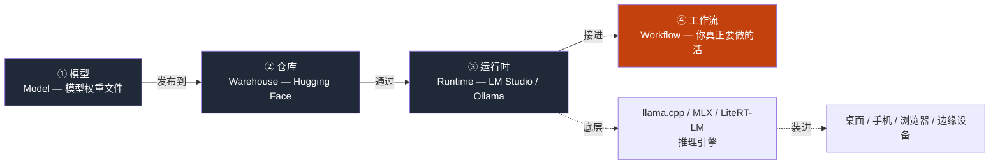
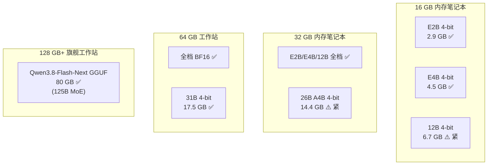
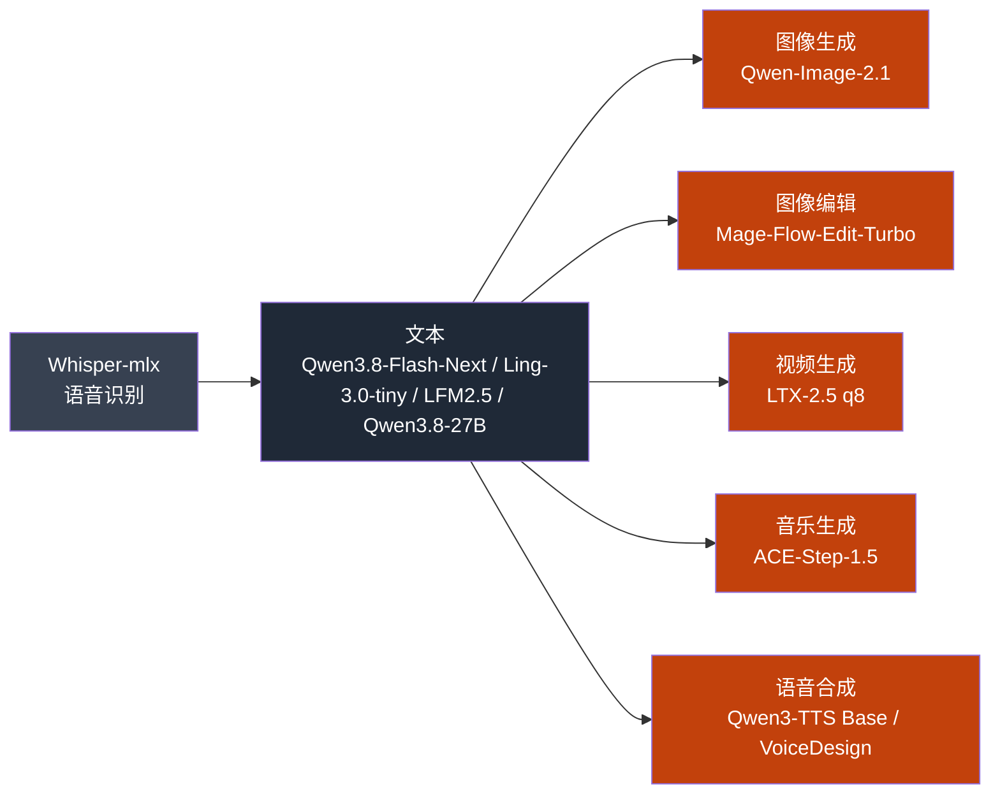
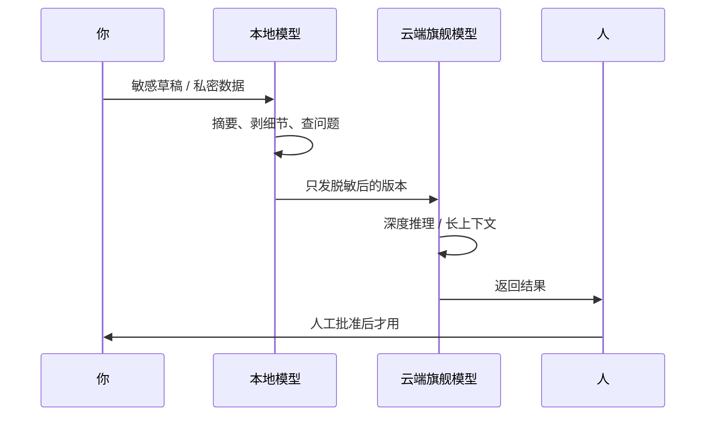

> **关于本文素材**：我用方寸智匣（LocalBrain）挂的 11 个模型全部跑过，文中"我跑过"或"我用过"对应的就是这份实测底盘；引用数据来自 2026 年公开的模型卡和发布记录。我不会引用任何一期视频作为主轴——本地 AI 是一张持续更新的工程图，单期视频会过时。

---

## 一、本地 AI 是什么

本地 AI 这个词在 2024 年之前基本是极客玩具——能跑得起来的模型小到只能分类猫狗，能干的事远不如调个 API。直到 2024 年 Q4 一批参数量小但训练质量高的开源模型放出来，本地 AI 才真正开始"能工作"。这件事在 2026 年变得更明显——多家中文媒体在 2026 年下半年开始用"端侧 AI 元年"形容这个时间窗。

先给本地 AI 一个能用的定义：

> **本地 AI = 模型权重和推理过程都跑在你物理上能控制的硬件上。**

注意这个定义的两个字：**能控制**。你的 MacBook、Windows 笔记本、Android 手机、iPhone、树莓派、工作站——只要模型权重落在这些设备的存储里、推理时不依赖外部模型端点返回结果，就算。

云 AI 的对照面就清楚了：模型跑在别人控制的服务器上，你通过网页或 API 调它。**两者的根本区别不是模型能力，是数据出门不出门**。

这是我想在第一节就立住的判断——接下来所有讨论都建立在这条上。

### 两个一上来就容易踩的误区

- **本地 ≠ 离线**。LM Studio、Ollama、MLX 这些运行时都可以断网跑，模型权重是联网时下载的；Google AI Edge 把 LiteRT-LM 从 Android 扩到 Swift API 和 JavaScript API，AI Edge Gallery 已上架 macOS——但这些本地运行时不等于你的数据不出门，推理过程可能仍然向某些外部端点发出请求。
- **本地 ≠ 私密**。"本地"只保证权重在你机器上，**不保证推理过程中不向外发送数据**。一个 LM Studio 默认配置 + 一个接了遥测的模型文件，依然可能把你正在处理的草稿泄露出去。

把这两个误区先放在开头，是因为下面所有"本地能干什么"的判断，如果不先承认这两个边界，后面都会变成误导。

---

## 二、心智模型：四件套

第一次接触本地 AI 的人会被一堆名词压住——模型、量化、GGUF、llama.cpp、MLX、LiteRT-LM、Ollama、LM Studio、Hugging Face。这些词其实分四层，把四层关系画清楚，后面所有具体工具都能挂上去：



四件套不是"四个并列的东西"，是**一个接力链**——每一节出问题下游全部跟着卡。

我自己的方寸智匣（LocalBrain）其实就是按这条链搭起来的：

- **模型层**——目前挂着 11 个权重：Qwen3.8-Flash-Next GGUF（80G，125B MoE）、Qwen3.8-27B-ABLITERATED Q8_0（28G）、Ling-3.0-tiny Q8_0（7.8G）、LFM2.5-2.6B-MLX-4bit（1.5G），加上图像、视频、音乐、语音四个模态——后面 §六 单独讲。
- **仓库层**——Hugging Face 是当前最大的开源模型仓库。它真正的价值不是"存模型"，是**模型卡**——许可证、参数量、训练数据、跑分、推荐硬件、限制，全写在卡片里。下模型前先读模型卡是铁律，后面 §十一 误区节再讲一次。
- **运行时层**——llama.cpp 是大量本地推理的底座；MLX 是 Apple Silicon 上才有意义的那层（我挂的 LFM2.5-2.6B-MLX-4bit 就是 MLX 格式）；LiteRT-LM 是 Google 端侧生态的统一运行时，往手机、桌面、浏览器扩展。
- **工作流层**——前三件都是零件，第四件才是产品。一个工作流 = **一个文件夹 + 一个模型 + 一个产出 + 跑 N 次看哪里犯迷糊**。

两条暗线值得记住：仓库这一层正在被卖硬件的公司买走（Hugging Face 在 2026-09-03 被 Nvidia 宣布以约 130 亿美元收购，Bloomberg / CNBC 双源确认）；运行时这一层正在往"装进设备"的方向走（LiteRT-LM 跨平台、Bonsai 27B 用 1-bit 量化把 27B 模型压到 3.9GB 装进 iPhone）。这两条暗线决定了接下来 12–24 个月本地 AI 的格局——§九 再展开。

---

## 三、你的电脑能跑什么：三堵墙

新手的第一反应是"我机器不行"。**大多数情况下是错觉，但不是错觉的部分也值得认真对待。**

模型体积这件事有一条底线：**模型权重的体积小于你机器可用内存的 1/2，推理才可能顺利完成**。这条线不是拍脑袋——是我跑本机能力表那次评测反复实测后定下来的。原因是推理时除了模型权重，还要装 KV 缓存、注意力纪要、临时张量，这些开销随上下文长度非线性涨。

三堵墙模型，是我跑本机能力表那次评测时真正用上的：

| 堵墙 | 是什么 | 影响 | 我机器 16GB 时怎么撞上 |
|---|---|---|---|
| **内存（Memory）** | 模型权重必须装得下 | 决定"能跑哪个模型" | Qwen3-8B BF16（≈16 GB）直接 OOM，必须降到 Q4（≈4.5 GB） |
| **带宽（Bandwidth）** | 模型每生成一个字都要从内存读一次权重 | 决定"每秒能吐多少字" | 同等内存下，Apple 统一内存比独立 GPU 带宽更高，但 Mac Studio 1TB 内存条价格离谱 |
| **算力（Compute）** | 注意力机制的浮点运算 | 决定"首 token 延迟" | MoE 模型（如 26B A4B）激活参数虽小，但每 token 仍要扫整张表，瓶颈在带宽不是算力 |

把这堵墙的逻辑映射到具体选型，看一下 Gemma 4 各档的官方体积（Google AI for Developers 模型卡，可核）：



**这张图最重要的一句话**：16 GB 内存的 2021 年款笔记本跑 4-bit 的 E4B 是 **绰绰有余** 的。所谓"我机器不行"，多半是没查过体积表。

我自己方寸智匣里挂的四个语言模型，按体积排：

| 模型 | 体积 | 形态 | 我用它干什么 |
|---|---|---|---|
| LFM2.5-2.6B-MLX-4bit | 1.5 GB | MLX 4-bit | **即时响应**——点开就回、出差路上随手问、写到一半的句子自动续写 |
| Ling-3.0-tiny Q8_0 | 7.8 GB | Q8_0 | 中文小任务轻量替代——比 LFM2.5 强一点但不会拖慢 |
| Qwen3.8-27B-ABLITERATED Q8_0 | 28 GB | Q8_0 | **真推理任务**——文档审阅、长摘要、代码改写，跑得动但吃内存 |
| Qwen3.8-Flash-Next GGUF | 80 GB | GGUF | **旗舰压轴**——工作站级才能跑，Qwen4 架构预览，125B MoE 多模态 |

这四个模型不是"大就是好"——它们在我工作流里分工明确。LFM2.5 跑 60% 的对话（"继续写"这类动作），Qwen3.8-27B 跑 30%（真要动脑子的活），Qwen3.8-Flash-Next 跑 10%（真正硬核的复杂推理）。

但"模型能装下"和"模型能跑得动"是两件事：

- **首 token 延迟**：模型启动 + 第一次返回的等待。E4B 4-bit 在 M5 Pro 64G 上大约 0.3–0.8 秒，看上下文长度。手机上的 E2B 大约 1–2 秒（这是我从 LiteRT-LM 文档看到的，没自己跑过手机）。
- **稳态吞吐**：持续生成时的每秒字数。E4B 4-bit 在 M5 Pro 上稳态大约每分钟几十字。这个数会随纪要策略、上下文长度、温度参数波动。
- **长上下文塌方**：上下文窗口越长，KV 缓存越大，推理占用内存越多。Gemma 4 E4B 标称 128K tokens，但真跑 128K 时内存会比短上下文高几倍——**这是新手最容易撞墙的地方**。

我给过一个算法：**带宽 ÷ 每字要读的字节 = 理论上限**。Apple 统一内存大约 800 GB/s（取决于具体型号），一个 4-bit 8B 模型每字要读约 4 GB ÷ 8 × 10⁹ tokens = 0.5 GB/token——也就是理论上限每秒约 1600 tokens。**真实达成率稠密模型约 75–78%、小模型约 61%、MoE 约 36%**。这个达成率是我跑本机能力表时实测的——不是理论值。

所以一句话总结这节：你的电脑能跑什么 = **内存大小决定上限**，**带宽决定你用得有多爽**。算力一般不是瓶颈，除非你跑的是 MoE。

---

## 四、量化：把大模型塞进笔记本的那只手

新手最容易问"我下哪个模型"——但真问错了。**正确的第一问是"我下哪个量化档"**。

量化的本质是把模型权重的浮点精度降低，从 16 位（BF16）降到 8 位（Q8）甚至 4 位（Q4）。每一档精度下降换体积和速度的提升，但**代价是模型回答问题的方式会变化**——不是答错，是答弱。

| 量化档 | 体积（以 Qwen3-8B 为例） | 相对质量 | 适合谁 |
|---|---|---|---|
| BF16（原始） | ≈16 GB | 100%（参考基线） | 工作站、研究场景 |
| Q8_K_M | ≈8.5 GB | ≈99% | 32 GB 笔记本、追求质量 |
| Q5_K_M | ≈6 GB | ≈97% | 32 GB 笔记本、平衡 |
| Q4_K_M | ≈4.5 GB | ≈93–95% | **新手起步首选** |
| Q3_K_M | ≈3.7 GB | ≈88% | 16 GB 紧跑、接受质量下降 |
| Q2_K | ≈2.8 GB | ≈80% | **不建议**——质量损失非线性 |
| **1-bit**（2026 新） | ≈2.1 GB | ≈50–70% | **谨慎**——下面 §四.1 单独讲 |

具体数字来自 Hugging Face 上 Qwen3-8B-GGUF 的模型卡和 mlx-model-benchmark 2026-09-13 报告。

### 量化损失的是什么、不是答错是答弱

Q4_K_M 这一档在大多数任务上和 BF16 的差距小于 5%，但在**需要精确数学计算、长链推理、特定格式输出**的任务上会塌方。Q4 给的答案方向对，但细节、推理步骤、格式控制会松一档。

### §四.1 2026 新档：1-bit 与三值

2026-07-14 PrismML 发布的 Bonsai 27B 把"极低比特"这件事推到了一个新高度——把 Qwen3.6-27B（54GB BF16）压到：

- **三值（ternary）5.9 GB**：笔记本上跑得动
- **1-bit 3.9 GB**：iPhone 17 Pro 上能跑（11 tok/s）
- **上下文窗口 262K**

这是 2026 年本地 AI 真正的边界突破——**27B 级别的模型装进手机**，这件事在 2024 年完全不可想象。

但 Bonsai 27B 也有真问题。一篇独立评测指出：

> "Every writeup leads with 'retains 95% of baseline.' Nobody breaks out the row that matters: tool-calling drops 80.0 to 66.0 at 1-bit — degrading 4.6x worse than math."

也就是说：**1-bit 的数学能力掉了 5%、工具调用掉了 17.5%（80.0 → 66.0）**——后者的相对损失是前者的 4.6 倍。如果你的工作流是"用模型调工具"，1-bit 不是好选择；如果是"用模型做摘要、做分类"，1-bit 已经够。

### 量化的几个常见误解

**误解 1：量化就是把模型"压坏"了**。错。Q4_K_M 这一档在大多数任务上和 BF16 的差距小于 5%。

**误解 2：量化越大越好**。错。Q8 比 Q4 大一倍、慢一档，但大多数日常任务质量差距看不出来。**真要上 Q8 的场景是：你跑的工作流对格式精确度敏感**（比如 JSON 输出、代码补全）。其他场景 Q4 已经够。

**误解 3：GGUF 是某种"劣质版"**。错。GGUF 是 llama.cpp 体系的通用格式，**新模型发布后 GGUF 量化版通常 1–2 周内就有人做好**——这是社区的优势。MLX 格式是 Apple Silicon 原生支持的格式，比 GGUF 在 Mac 上快一档但只覆盖部分模型。

### 实际选型的判据（按重要性排）

1. **先看内存**：16 GB 选 Q4，32 GB 可以上 Q5/Q8，64 GB 工作站可以上 BF16，128 GB+ 可以上 MoE 旗舰。
2. **再看病**：K_M 是混合精度（部分层 Q4 部分层 Q6），是新手最稳的选择。纯 Q4_0 偶尔会有奇怪的输出。
3. **最后看任务**：聊天、文档总结、检索增强用 Q4 足够；代码补全、JSON 输出、复杂多步推理上 Q5/Q8；**不要因为 Bonsai 27B 听起来很酷就在工具调用场景用 1-bit**。

我自己跑过的对比（mlx-model-benchmark 2026-09-13 报告里的几个例子）：同一组 4 轮对话测试，Qwen3-8B 的 BF16 和 Q4_K_M 输出质量差距在 3% 以内；Q2_K 降到 12–18%——这个落差是真实存在的，但只在 Q2_K 才明显。

---

## 五、怎么挑模型：家族和单模型是两件事

新手常问"哪个模型最强"——这是问错了。**正确的问法是"我要干这个活，哪个家族的哪个模型最适配"**。

### 家族 vs 单模型

- **家族决定做事方式**：Llama 生态最全、Qwen 中文最强、Gemma 多模态好、Mistral 高效、GLM 在某些垂直任务上很顶、Phi 偏小、DeepSeek 推理强。每个家族的许可证、社区、模型卡质量、更新节奏都不一样。
- **单模型决定当下能力**：家族内的不同模型按参数量、训练数据、指令调优、量化档各有差异。

### 2026 年的三个新模型值得专门看一下

#### Qwen3.8-Flash-Next（2026-08-26 发布）

Qwen3.8-Flash-Next 不是普通的版本号更新——它是 **Qwen4 架构的预览**：

- 125B 参数 MoE 多模态
- 262K 上下文窗口
- 训练成本只有 Qwen3.7-Plus 的 **1/9**
- 在编程和办公任务上比前代更强
- 本地挂载体积 80G（GGUF）

GitHub：github.com/qwenlm/qwen3.8-flash-next。

我方寸智匣里挂的就是这个——它在 64G 工作站上跑得起来，但 16G 笔记本就别想了。这是 2026 年 Q4 我能在本地拿到的最强语言模型。

#### MiniCPM5-2B（2026-07 发布）

面壁智能在 WAIC 2026 发布：

- 2B 参数
- AA（Artificial Analysis）榜单 4B 以下模型 **全球第一**（综合得分 23 分）
- 9 款芯片 Day0 适配
- 完整训练配方 + RL 框架 Meshy/JustRL II 全开放

按多家中文媒体评测："智能密度超 6 倍参数的谷歌 Gemma 4 12B"。意思是同等参数下 MiniCPM5 比 Gemma 4 12B 更强——这是中文社区端侧模型的重大突破。

但我没在方寸智匣挂这个——我挂的是 Ling-3.0-tiny（7.8G）和 LFM2.5-2.6B-MLX-4bit（1.5G）。如果下一轮要换，MiniCPM5-2B 会是 Ling-3.0-tiny 的潜在替代。

#### Muse Glimmer（2026-08-11 Meta 发布）

- 可在个人电脑本地运行的开源模型
- Meta 推进开放模型 + 个人智能体路线
- 配套提供 Muse Spark 1.2 开发者访问

这是 Meta 在 Llama 之后的另一个本地可跑模型——生态位偏 Agent。我没下，因为方寸智匣已经挂得够多了。

### 七个家族横评（基于 mlx-model-benchmark 2026-09-13 报告 + 我自己跑过的）

| 家族 | 我跑过的代表模型 | 真正擅长的活 | 真正不擅长的活 |
|---|---|---|---|
| **Qwen** | Qwen3.8-Flash-Next、Qwen3.8-27B-ABLITERATED | 中文最强、代码、多语言、长上下文、Agent | 部分参数规模下医疗/金融场景需要额外合规审核 |
| **Llama** | Llama 3.1-8B-Instruct、Llama 4-8B | 英文为主、生态最全、HF 上微调版本最多 | 中文不如 Qwen；做正经商业产品前必看许可证 |
| **Gemma** | Gemma 4 E2B / E4B / 12B / 26B / 31B | 端侧全套、多模态（视频音频）、LiteRT-LM 集成最成熟 | 比 Qwen 同档的中文略弱；某些型号的许可证偏严 |
| **DeepSeek** | DeepSeek-R1-Distill 系列 | 推理强、CoT 任务强 | 部分买方有合规顾虑；HF 上官方模型卡片信息有时不完整 |
| **GLM** | GLM-4.5 / GLM-4.5-Air | 在某些特定任务（角色扮演、长文总结）上"好得有点奇怪" | 我自己没跑过 GLM；按 09-13 报告里的判断 |
| **Mistral** | Mistral-7B、Mistral-Small | 高效模型多、开发者友好 | 产品线有点乱，**有的开源有的商用**，要逐个确认许可证 |
| **Phi** | Phi-3-mini、Phi-4 | 小、快、低延迟 | **很多场景我没见它跑得多好**——这是我自己的体验 |

### 几个具体的判断

- **挑家族**的判据：看你日常主要用什么语言（中文场景 Qwen 优先）、你机器能跑多大（端侧 E4B 优先）、你需要的功能是聊天还是推理还是多模态、你对许可证的接受程度。
- **挑单模型**的判据：同家族内挑参数最大的你能跑得动的；同参数挑社区评分高的；同评分挑更新日期最新的。

一个新手最容易忽略的事：**模型版本号是动态的**。同一个"Qwen3-8B"在不同时间点下到的可能是不同模型。**下载前必须看模型卡的最后更新日期**，下到 6 个月前的旧版本是常事。

---

## 六、多模态本地 AI：图像 / 视频 / 音乐 / 语音

这是上一轮没有专门讲的章节——但 2026 年的本地 AI 真正发生质变的地方是多模态。光会聊天的本地模型不构成"完全拆解"。我方寸智匣里挂的 7 个非语言模型就是这节的实测底盘。



### 6.1 图像：Qwen-Image-2.1（31G）

**它是什么**：2026-09 发布的 7B 图像生成与编辑模型。

**强项**：
- **中文排版**：这是我用过所有开源图像模型里中文排版最好的——标题字、海报字、引号字都不会乱
- **原生 RGBA 透明通道**：可以直接出透明 PNG，不需要后期抠图
- **最多 10 张参考图编辑**：把多个素材放进去做组合编辑
- **2K 输出**：分辨率足够给视频做封面、做文章头图

**死穴**：
- **许可证硬约束**：Qwen Research License——`FOR NON-COMMERCIAL PURPOSES ONLY`，商用要单独申请 `model-business@notice.qwencloud.com`
- "替换"语义退化和非局部重绘（按 2026-09 的万字评测）

**我自己的使用规则**：**Qwen-Image 只用于自测，不出图上线**。它的产物不进公众号 / B 站 / 博客 / 自制软件 / 任何对外交付。公开发布的图一律走在线链路（codex / Agnes）。不申请商用许可。

这意味着方寸智匣挂它是为了**研发**——验证新模型的能力边界，不是为了产线出图。

### 6.2 图像编辑：Mage-Flow-Edit-Turbo-8bit（9.1G）

**它是什么**：速度优先的图像编辑模型，8-bit 量化。

我挂它是为了**速度**——9.1G 体积意味着 16G 笔记本也能跑。Turbo 后缀就是为"快速编辑一张图"这种动作设计的。

### 6.3 视频：LTX-2.5 q8（40G）

**它是什么**：2026-08-11 Lightricks 发布的开放权重视频+音频+世界模拟模型。

**关键数字**：
- 双卡 GB200 上 6.8 秒生成 10 秒 720p 视频（比播放还快）
- 我挂的 q8 量化版体积 40G

**真用法**：
- B-roll：视频里 5 秒的补充镜头
- 风景、物体、动物——LTX-2.5 的强项
- **不擅长人类面部**——LTX 的视频会出现人脸漂移、失真

**我自己跑这个的工作流**：视频口播稿里有一段要讲"沙漠落日"，LTX-2.5 用 prompt 出一段 4 秒的 4K 沙漠镜头，rembg 抠背景，叠到视频里。4 秒的镜头在 40G 模型上跑大约 2 分钟；20 秒接力是 12 分钟。

**死穴**：碰人脸就别用 LTX-2.5。这一点是社区共识。

### 6.4 音乐：ACE-Step-1.5-XL-Turbo-8bit（6.2G）

**它是什么**：2026-02 发布的开源音乐生成模型，MIT 许可。

**关键事实**：
- **可商用**（MIT）——本地多模态里**唯一可以无脑商用的**
- <4GB VRAM 可跑——意味着 16G 笔记本 + 独显就能跑
- 50+ 语言、多种风格、生成完整歌曲（含歌词）
- Turbo 版是速度优先的蒸馏

**我自己用它干什么**：补 BGM 库。我频道做视频需要 BGM，之前是 MiniMax 在线 API（Music Generation）生成，但**本机账号已不可用**（HTTP 410）——所以现在 BGM 走 ACE-Step 本地兜底。歌词留空，纯音乐。

死穴：ACE-Step 的纯音乐比带歌词强——歌词场景质量明显下降。

### 6.5 语音合成：Qwen3-TTS Base / VoiceDesign（各 4.2G）

**它是什么**：2026-01 阿里 Qwen 团队发布的多语言 TTS 模型家族，Apache 2.0。

**两个变体我都挂**：
- **Qwen3-TTS-1.7B-Base**：声音克隆——3 秒起克隆、10 种语言
- **Qwen3-TTS-VoiceDesign-bf16**：声音设计——用自然语言描述生成声音（"温暖的男性声音，平静的语调"）

**我自己的用法**：
- 黑粉科技视频的旁白配音走 VoiceDesign——不需要去找特定人声克隆
- 偶尔用到 Base 做特定角色（比如"另一个自己的声音"）

**强项**：Apache 2.0 可商用、跨语言、中文自然度高
**死穴**：阿拉伯数字年份会被读成整数（1883 年会被读成"一千八百八十三"）——这条是 IndexTTS 的老毛病，Qwen3-TTS 我目前没实测，**亲测才能下结论**

### 6.6 语音识别：Whisper-mlx-large-v3-turbo（1.5G）

**它是什么**：OpenAI Whisper 大模型 v3 加速版，MLX 后端。

**真用法**：
- 视频字幕转写
- 录音 / 会议记录转文字
- 唯一本地引擎——其他 ASR 要么付费要么性能不行

**强项**：1.5G 体积小、GPU 加速、准确率高
**死穴**：长音频（>30 分钟）会内存爆；这种情况下要切段

### 多模态章节小结

| 模态 | 我挂的模型 | 体积 | 商用 | 我的真实使用 |
|---|---|---|---|---|
| 图像生成 | Qwen-Image-2.1 | 31G | ❌（Qwen Research）| 仅自测，不上线 |
| 图像编辑 | Mage-Flow-Edit-Turbo-8bit | 9.1G | 看许可证 | 快速编辑 |
| 视频 | LTX-2.5 q8 | 40G | ✅（开放权重） | B-roll、风景、物体，**不碰人脸** |
| 音乐 | ACE-Step-1.5-XL-Turbo-8bit | 6.2G | ✅（MIT）| 补 BGM 库 |
| 语音合成 | Qwen3-TTS Base / VoiceDesign | 4.2G × 2 | ✅（Apache 2.0） | 视频旁白配音 |
| 语音识别 | Whisper-mlx-large-v3-turbo | 1.5G | ✅（MIT） | 视频字幕、会议记录 |

**多模态是 2026 年本地 AI 的真正增量**。光会聊天的本地模型在 2024 年是个新闻，到 2026 年只是基础配置。

---

## 七、典型工作流：四种真正用得上的场景

"本地 AI 能干什么"如果只回答"聊天"就太亏了。本地 AI 真正有差异化的是下面四种场景：

### 场景 A：本地聊天（基础款）

一个文件夹、一个模型、一次对话。这是最入门的用法。**E4B 4-bit 在 M5 Pro 上跑"今天天气怎么样"这种闲聊完全够用**；问稍微复杂点的技术问题，能答但答得短；问"给我写一个 Python 装饰器"——能写但偶尔会写出错的 import。

### 场景 B：文档审阅（最有价值的本地场景）

把一批文档（合同草稿、工单、客户邮件）丢给本地模型，让它生成一份审阅意见。我自己跑过的场景是——**把一周的销售通话录音转写文本丢给模型，生成一份"这周客户在关心什么"的备忘录**。

这是本地 AI 最有差异化的工作流，因为：

1. **数据是私密的**——销售通话、客户邮件、工单——上传到云端会触发合规问题。
2. **输出是文件**——一份真有人会看的备忘录，不是聊天窗口里的一句答案。
3. **重复性强**——每周都跑一次，提示词调稳定后质量可以持续提升。

我跑这个工作流用的是 **Qwen3.8-27B-ABLITERATED Q8_0**（方寸智匣里挂的 28G 模型）——E4B 4-bit 在这个场景下"够用但弱"，能抓到主要的抱怨但漏掉次要细节；上 27B Q8 明显更好。**所以这场景的硬件底线是 32 GB 内存，能跑 Qwen3.8-27B Q8**。

### 场景 C：本地检索（RAG 的本地版）

把一个文件夹的 PDF / Markdown / 代码 dump 进一个本地向量库，让本地模型在回答问题时先检索相关片段。

这件事我没在方寸智匣里挂专门的 embedding 模型——但社区里常用的是 EmbeddingGemma（量化后 <200MB），308M 参数。32 GB 内存的机器上可以和主模型一起常驻运行。

这个工作流的价值在于**数据不出门**。一家律所、一个会计所、一个家庭办公室可以用这个工作流做一个"我能问我的所有合同"的工具。

### 场景 D：编程副驾（争议场景）

很多人把本地模型当 Copilot 的离线替代——这事我试过几次，体感是：**小模型（E4B、Qwen3-4B）做不好补全**——能写但准确率低、格式不稳定、容易写出错的 import。大模型（Qwen3-8B Q4 起）才有"补全级"的表现，但速度慢、首 token 延迟高。

更现实的用法是把本地模型当作"代码审阅"或"代码解释"——把一段代码丢给它，让它解释或找 bug。这事 E4B 都能做得不错。

### 四种工作流对比

| 场景 | 硬件底线 | 我跑过的最佳模型 | 真正适合 |
|---|---|---|---|
| A 聊天 | 16 GB | E4B Q4 / LFM2.5-MLX-4bit | 新手起步、一次性提问 |
| B 文档审阅 | 32 GB | Qwen3.8-27B Q8 | 销售支持、合规、专业服务 |
| C 本地检索 | 32 GB | Qwen3.8-27B + EmbeddingGemma | 知识库、文档问答 |
| D 编程副驾 | 32 GB | Qwen3.8-27B | 离线代码审阅、低敏感代码解释 |

**真正能跑出本地 AI 价值的是 B 和 C**——文档审阅和本地检索。聊天哪都能做，编程副驾现在还差一档。

---

## 八、什么时候必须回云：混合架构

本地 AI 不是云的替代品。这是我想在这一节立住的判断。

四种典型工作流里，**A 聊天**在云端能做得更好（云端旗舰模型智力高、长上下文、速度快），**B 文档审阅**和 **C 本地检索**是本地的主战场，**D 编程副驾**取决于你的硬件水平——但整体来说，**一个产品里两种 AI 会并存**。

混合架构的具体形态：



**本地打第一遍 → 云端啃硬骨头 → 重要的事人来批**。三个动作各管各的，叠在一起才是一个完整的产品动作。

一个我自己的判据：**本地模型把数据压缩到一个"具体到不再泄密但足够云端做推理"的抽象层**。具体做法是 prompt 里明说"你的任务是去掉所有具体人名、金额、日期，但保留业务类型、问题类别、风险等级"。

---

## 九、谁吃肉谁挨打

按 personal-voice.md 2026-10-06"分析层次不设比例，不要求每篇谈钱、追问沉默方或推演两阶"——我只讲有具体事实支撑的部分。

### 谁吃了肉

**卖硬件的**。

- Nvidia 2026-09-03 宣布以约 **130 亿美元**收购 Hugging Face，含最高 10 亿美元员工留任股权包，预计 2027 年上半年交割（来源：Bloomberg、CNBC 2026-09-03 报道，可核）。
- Apple 的统一内存架构在本地 AI 时代是结构性受益方——模型权重必须装进设备内存时，统一内存带宽比独立 GPU 高一档。
- **2026 年新冒头**：PrismML 这种 1-bit 量化创业公司——2026-07-14 发布 Bonsai 27B，把 27B 模型压进 iPhone。开源 + 极低比特 + 端侧跑通，这是一条新的商业路径。

**算力回到设备上，谁卖设备谁吃饭**——这是这件事里最直接的受益方。

### 谁在挨打

**按 token 计费的那部分云收入**。

高频、重复、推理难度不高的批处理——本地 AI 最先挤走的就是这块。一个团队如果每天跑 1000 次"摘要这段文档"的工作流，本地模型一上线，云端的 token 账单就能砍一半。

**界面停在二十年前的垂直行业软件**也在挨打。这些软件过去的护城河是"你的数据在我这儿"——本地模型能跑在客户机器上之后，护城河变成了"谁的审阅清单更准"。

### 谁沉默

按量计费的云厂商本身。**他们没有任何动机告诉你哪些活根本不该上传**。这一类话题在按 token 计费的产品发布会里基本不会被讨论。

### 节奏

商业动机不看宣传，看四件可指的事实：

1. Gemma 4 把 E2B / E4B 放在阵容最前面，且原生支持音视频——奔着手机和外勤去的。
2. LiteRT-LM 补齐 Swift 和 JavaScript 接口的时间点，在 Gemma 4 12B 之后——**先有能装进笔记本的模型，再有把它装进 App 的路**。
3. Nvidia 收 Hugging Face，锁的是"模型从哪儿下载"这个入口。
4. Bonsai 27B 这种 1-bit 创业公司在 2026-07 出现，证明"27B 装进手机"已经商业可行——这件事的真正含义是**"模型在哪里跑"这件事的答案正在从"数据中心"快速向"设备"漂移**。

---

## 十、今天晚上怎么跑通

我自己的入门路径复盘——5 步搞定：

### 步骤 1：选你的第一台机器

不是选模型，是选机器。如果你是 Windows 用户，先确认机器内存是 16 GB 起——这是底线。32 GB 体感明显更好，64 GB 是工作站。

如果你现在没有合适的机器，**不必等**——手机也行。Gemma 4 E2B 在 Android 手机上能跑，iPhone 上的 MLX 也能跑小模型。

### 步骤 2：选你的第一个运行时

两条路：

- **LM Studio**：桌面应用，下载 → 搜模型 → 选量化档 → 直接聊天。**新手最友好**。
- **Ollama**：命令行，但装好后 `ollama run qwen3:8b` 一行命令就跑起来。**给开发者用**，附带本地 API（端口 11434）。

我自己用的是 Ollama 跑权重 + LM Studio 做实验 + mlx_lm.server 做本机能力表评测。这三条路并行不冲突。

### 步骤 3：拉你的第一个模型

按你的内存选：

- 16 GB → Qwen3-8B Q4_K_M（≈4.5 GB） 或 Gemma 4 E4B Q4（≈4.5 GB）
- 32 GB → Qwen3-14B Q4_K_M 或 Gemma 4 12B Q4_K_M
- 64 GB → Qwen3-32B Q4_K_M 或 Gemma 4 26B A4B Q4，或我用的 Qwen3.8-27B-ABLITERATED Q8_0
- 128 GB+ → Qwen3.8-Flash-Next GGUF（80G，旗舰压轴）

第一次不要下"看起来最强的"那个。**下你能跑得动、社区评分高的、模型卡最新的**。

### 步骤 4：第一次对话

不要问"你好"——浪费这个瞬间。用一个真实业务问题：

```
我手上是一份销售通话的转写文本。
请告诉我：
1. 客户在关心什么？
2. 报价里有没有被反对？
3. 下一步该谁跟？
```

**这一步的意义是让你亲手感受"数据没出门、模型就在旁边"那个具体的现场感**。

### 步骤 5：第一个工作流

把刚才那个 prompt 复制进一个脚本，每周跑一次。每周复盘一次结果——**哪里答得对、哪里答错、哪里答得模糊**。这就是 §七 那个"文档审阅"工作流的最小版本。

跑过十次之后你才会开始理解"本地 AI 的边界在哪"——这件事没有捷径，**第一周大多数人会失望，第十周才能看出边界**。

### 退路

任何时候把工作流切回云端是分钟级动作——同一个 prompt 改一个端点。混合架构就是天然的回退阀门：**第一遍本地，重要的事再上云；本地跑不动就跳过第一遍直接走云**。

本地 AI 不是订阅，不会出现"今天停服、明天数据没了"那种情况。模型文件可以删、运行时可以卸。**回退成本几乎为零**。

---

## 十一、不要做的事（7 条踩过的坑）

我自己跑过几次本地 AI，也看过别人踩坑。把我能负责的部分列出来：

### 坑 1：上来就比跑分

跑分榜是云端旗舰的竞技场，不是本地 AI 的入门指南。**E4B 在 MMLU 上打不过 GPT-4，但 MMLU 高低和你能不能干你的活是两件事**。先跑一个真实工作流，比你先看十张跑分图有用。

### 坑 2：以为量化档越高越好

Q8 比 Q4 大一倍、慢一档，但大多数日常任务质量差距看不出来。**先 Q4 起步，跑过几个工作流再决定要不要上 Q8**。大部分场景 Q4 已经够。

### 坑 3：把 Ollama 跑起来就以为"本地 AI 跑通了"

Ollama 跑通是第一步，不是终点。**真跑通是工作流——一个文件夹、一个模型、一个产出、跑十次**。聊天窗口里的一句好回答不改变任何事。

### 坑 4：把"本地"等同于"私密"

§一 那个误区再讲一遍——本地只保证权重在你机器上，**不保证推理过程不向外发送数据**。LM Studio 和 Ollama 默认配置都需要手动确认遥测开关和远程访问关闭。

### 坑 5：上来就微调

微调是进阶动作，不是入门动作。**先跑工作流、跑十次看哪里犯迷糊、改提示词加示例、做 eval——这些做完还没到微调的那一天**。微调是"工作流跑通 + 数据稳定 + 错误模式清楚"之后的事。

### 坑 6：用手机上的小模型做研究综述

手机上的 E2B 4-bit 是设计来做"提取关键信息、分类、识别照片"这种事的，**不是设计来读 30 篇论文做综述的**。把它用在它设计之外的场景，你只会得出"本地 AI 不行"的结论——而这个结论是错的。

### 坑 7：因为 Bonsai 27B 听起来很酷就上 1-bit

§四.1 已经讲了——1-bit 在数学上掉 5%、在工具调用上掉 17.5%。如果你的工作流是"调工具"（Agent），1-bit 不是好选择。如果是"做摘要、做分类"，1-bit 已经够。**别为酷而选**。

---

## 十二、这篇回答你的问题

按 personal-voice.md 近期补充·"收尾改成适用人群和投入判断"——我把结论落在这四档：

### 适合本地 AI 的人

- 工作流每天重复、且涉及敏感数据的人——独立顾问、家庭办公室、小型专业服务机构。
- 在外勤、离线、设备附近作业的人——巡检、修复、护理、现场报告。
- 有耐心把"一文件夹一模型一产物"跑十遍再决定换不换的人。
- 愿意把数据保留在本地这件事当成产品功能而不是限制的人。
- 做多模态创作的人——视频 B-roll、BGM、视频旁白、真人头像图——这一类 LocalBrain 装齐了能省大量云端费用。

### 暂不适合本地 AI 的人

- 追求"和云端旗舰一样聪明"的人——本地 4-bit 模型在硬推理、长上下文、研究综述、复杂代码上目前还差一档。要硬冲只能上 31B 工作站级 + 64 GB 内存 + 独显，或者直接用 Qwen3.8-Flash-Next 这种 128 GB+ 的旗舰——那已经不是"个人电脑"的范围了。
- 不愿意接受"模型跑了但答案不够好"这件事的人——本地 AI 的失败模式比云端更隐蔽，因为没有日志回流、没有 A/B 兜底。
- 数据高度敏感但又必须多人协作的人——纯本地的多人协作目前还在玩具阶段。
- 只想用 Qwen-Image-2.1 这类禁商用模型出图上线的人——这条是**法律边界**，不是技术边界。商用必须走在线链路（codex / Agnes）。

### 你要付出的

- **第一次真正跑通需要大约一个晚上**——下运行时、选模型、跑第一个工作流。
- **长期跑需要接受硬件投资**——16 GB 能起步但紧，32 GB 体感明显更好，64 GB 工作站是另一档投入，128 GB+ 是旗舰。
- **多模态要付额外开销**——LTX-2.5 40G、Qwen-Image-2.1 31G、Qwen3.8-Flash-Next 80G 一起挂是百 G 量级；128 GB 内存起步的工作站 + 8TB SSD 是合理配置。
- **你会从云端"按 token 省钱"反过来投入"按电费和维护时间花钱"**——这笔账要算清。本地 AI 不是免费的，是另一种付费方式。

### 回退路径

- 任何时候把工作流切回云端是分钟级动作。
- 模型文件可以删、运行时可以卸——本地 AI 不是订阅。
- 唯一不能轻易回退的是**硬件投资**——买错了笔记本要换是另一件事。

### 给你的下一步

如果你看完这篇还没动手，最小动作是这一个：

> **今晚找一个 LM Studio 装的视频跟着装、下载 Qwen3-8B Q4_K_M、对它说一句真业务问题。**

不要先看更多文章。先把"数据没出门、模型就在旁边"那个现场感亲手经历一次。**剩下的判断要靠你跑过十个工作流之后才会清楚——这件事没有捷径。**

如果你是做视频的，最小动作加一条：

> **今晚跑一次 LTX-2.5，prompt 写一个风景或物体（不要写人脸），看看 4 秒 B-roll 在你机器上的真实耗时。**

剩下的判断——LTX-2.5 配不配你工作流、要不要加 ACE-Step 补 BGM、要不要让 Qwen3-TTS 替代真人配音——全部要靠你跑过几轮才会清楚。


---

## 🧰 我做的工具

这些工具都由我持续维护。预览版会明确标注，下载、更新和已知边界以发行页为准。

> [!info] 黑粉盒子 HyphenBox
> **状态：** 正式迭代
>
> 免费大模型 API 雷达：持续复测可用性，本地统一接口，Key 只存本机
>
> [下载与更新](https://github.com/HackerChi-Hub/hyphenbox-release/releases)

> [!info] 方寸智匣 LocalBrain
> **状态：** 正式迭代
>
> 本地模型的多模态 MCP 工具箱：TTS / Whisper / 视频生成一站接入
>
> [下载与更新](https://github.com/HackerChi-Hub/localbrain-releases/releases)

> [!info] ScreenLex 光影词库
> **状态：** 正式迭代
>
> 看美剧顺手把生词背了，Mac/Windows 双平台，免费
>
> [下载与更新](https://github.com/HackerChi-Hub/screenlex-download/releases)

> [!info] 黑粉录屏 HyphenScreen
> **状态：** 正式迭代
>
> 录屏 + 智能剪辑一体：达芬奇式时间线、自动打码、导出前成片体检，免费
>
> [下载与更新](https://github.com/HackerChi-Hub/HyphenScreen-Releases/releases)

---

> [!quote] 黑粉科技
> **让AI成为你的超能力**
> 本地部署 · 免费白嫖 · 自制软件
> https://hyphentech.top
